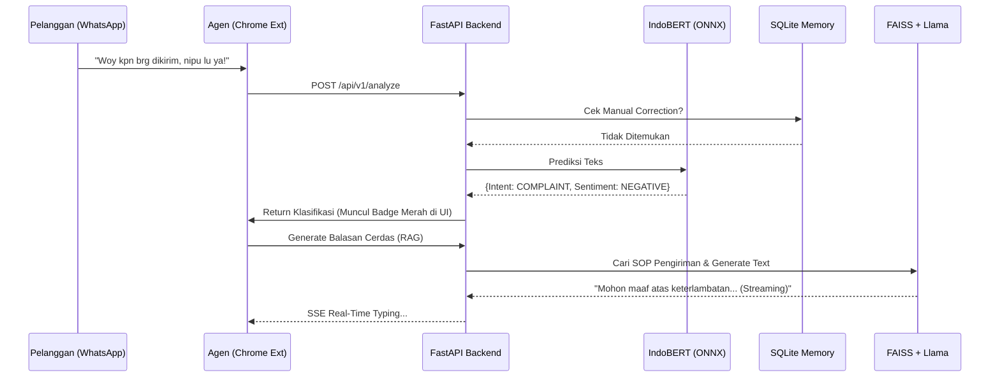

# 🚀 Emotext-CRM (WA-CRM Intelligence)


**Emotext-CRM** adalah platform *Customer Relationship Management* (CRM) inovatif berskala *Enterprise* yang mengintegrasikan kecerdasan buatan (AI) secara langsung ke dalam antarmuka WhatsApp Web. 

Dirancang khusus untuk tim *Customer Service*, sistem ini secara instan menganalisis sentimen, mendeteksi intensi pelanggan, dan memberikan balasan otomatis berlandaskan *Standard Operating Procedure* (SOP) perusahaan menggunakan arsitektur mutakhir **Offline Retrieval-Augmented Generation (RAG)**.

Sistem beroperasi dengan model bisnis **SaaS (Software as a Service)**, memisahkan ekstensi klien yang super ringan (< 5MB) dari mesin AI (*Backend*) raksasa yang aman di server cloud. Manajemen platform ini dilakukan melalui **Unified Web Portal** berarsitektur *Single Page Application* (SPA) untuk pengalaman *real-time* tanpa jeda *loading*.

---

## ✨ Fitur Unggulan (Core Features)
- **🧠 Localized NLP Engine (IndoBERT v2.0):** Dilatih khusus (Fine-Tuned) dengan >4.000 data sintesis bahasa jalanan, singkatan ekstrem, dan sarkasme. Akurasi klasifikasi Sentimen dan Intensi mencapai tingkat manusia.
- **📚 Offline RAG Knowledge Base:** Tidak menggunakan OpenAI. Menjalankan model Llama GGUF dan FAISS secara *offline* di *Backend* untuk membaca dokumen SOP perusahaan, menjamin **100% Data Privacy** (kerahasiaan data tingkat militer).
- **⚡ Real-Time Streaming (SSE):** Generasi jawaban AI ditampilkan secara *real-time* (token-by-token) kepada agen *Customer Service* di layar WhatsApp Web.
- **🛠️ Self-Learning Memory (Manual Correction):** Admin dapat memperbaiki klasifikasi yang salah. AI akan mengingat koreksi ini selamanya menggunakan lapisan *Memory Cache* SQLite.

---

## 🏗️ Arsitektur Sistem (Client-Server Architecture)

Untuk melindungi *Intellectual Property* model AI dan menjaga performa perangkat pelanggan (agar tidak membebani RAM laptop), Emotext-CRM memisahkan komputasi berat ke *Cloud*.

```mermaid
graph TD
    subgraph Client [💻 Client Side (User)]
        WA[WhatsApp Web]
        Ext[Emotext Chrome Extension]
        WA <-->|DOM Scraping & UI Inject| Ext
    end

    subgraph Internet [🌐 Cloud Network]
        Auth[Email & Password Auth]
        API[REST API / SSE Streams]
    end

    subgraph Server [☁️ Cloud AI Backend (Hugging Face Spaces)]
        FastAPI[FastAPI Server]
        
        subgraph NLP [NLP Classification]
            IndoBERT[(IndoBERT ONNX)]
        end
        
        subgraph RAG [Response Generation]
            FAISS[(FAISS Vector DB)]
            Llama[(Llama.cpp GGUF)]
        end
        
        DB[(SQLite/Postgres DB)]
    end

    Ext -->|Login| Auth
    Auth --> FastAPI
    Ext <-->|Send Chat & Receive Analysis| API
    API <--> FastAPI
    FastAPI --> IndoBERT
    FastAPI --> FAISS
    FAISS --> Llama
    Llama --> FastAPI
    FastAPI <--> DB
```

---

## 🔀 Alur Pipeline Kecerdasan Buatan (AI Flow)

Proses yang terjadi di dalam *Backend* dalam satuan milidetik ketika ada pesan masuk:



---

## 🌐 Panduan Deployment Backend (Bagi Developer)
*Agar ekstensi berfungsi, Backend ini wajib di-deploy (di-hosting) di server cloud.*

Karena model AI (*IndoBERT* dan *FAISS*) membutuhkan RAM yang cukup besar, kami merekomendasikan **Hugging Face Spaces** sebagai solusi *hosting* gratis terbaik (16GB RAM, 2 vCPU).

### Langkah-langkah Deploy ke Hugging Face Spaces (Gratis):
1. Buat akun di [Hugging Face](https://huggingface.co/).
2. Buat **Space** baru, berikan nama (misal: `emotext-backend`). Pada bagian SDK, pilih **Docker**, lalu pilih *template* **Blank**. Pastikan *Space hardware* yang terpilih adalah **CPU Basic (Free)**.
3. Unggah seluruh isi folder `produk_extension/backend/` beserta folder `models/` ke dalam Space tersebut.
4. Buat file `Dockerfile` di *root* direktori Space Anda dengan konfigurasi standar FastAPI Uvicorn:
   ```dockerfile
   FROM python:3.10
   WORKDIR /app
   COPY ./requirements.txt /app/requirements.txt
   RUN pip install --no-cache-dir -r /app/requirements.txt
   COPY . /app 
   CMD ["uvicorn", "main:app", "--host", "0.0.0.0", "--port", "7860"]
   ```
5. Hugging Face akan otomatis membangun kontainer dan men-*deploy* API Anda. Anda akan mendapatkan URL publik (contoh: `https://username-emotext-backend.hf.space`).
6. Ubah URL API di dalam *source code* Ekstensi Chrome Anda agar menunjuk ke URL baru tersebut, lalu kompres (*ZIP*) folder ekstensi menjadi `Emotext-Extension.zip` untuk didistribusikan ke pelanggan.

---

## 💻 Panduan Instalasi (Bagi Pelanggan/User)

Pelanggan dapat menikmati layanan Emotext-CRM dengan langkah instalasi yang sangat mudah tanpa memerlukan keahlian teknis.

**Cara Memasang Emotext-Extension:**
1. Unduh file `Emotext-Extension.zip` dari halaman *Dashboard Website* setelah berlangganan.
2. Ekstrak (Unzip) file tersebut ke sebuah folder di laptop Anda.
3. Buka browser **Google Chrome** dan ketik `chrome://extensions/` di kolom URL.
4. Aktifkan **Developer mode** (Mode Pengembang) di pojok kanan atas layar.
5. Klik tombol **Load unpacked** (Muat yang tidak dikemas) di pojok kiri atas.
6. Pilih folder hasil ekstraksi `Emotext-Extension` tadi. Ekstensi berhasil dipasang!

---

## 🔑 Panduan Pengaktifan & Login

Sistem diamankan dengan kredensial berlangganan untuk mencegah penggunaan pihak ketiga yang tidak sah.

1. Buka [WhatsApp Web (web.whatsapp.com)](https://web.whatsapp.com) di Google Chrome Anda.
2. Saat pertama kali dibuka, layar *pop-up* Emotext-CRM akan muncul meminta otentikasi.
3. Masukkan **Alamat Email** dan **Password** langganan Anda.
4. Setelah berhasil *Login*, sistem akan aktif secara permanen dan secara ajaib menyulap tampilan WhatsApp Web Anda menjadi dasbor CRM kelas atas!

---

*Emotext-CRM v1.0 - Stable Release. Developed by Fawwaz.*
