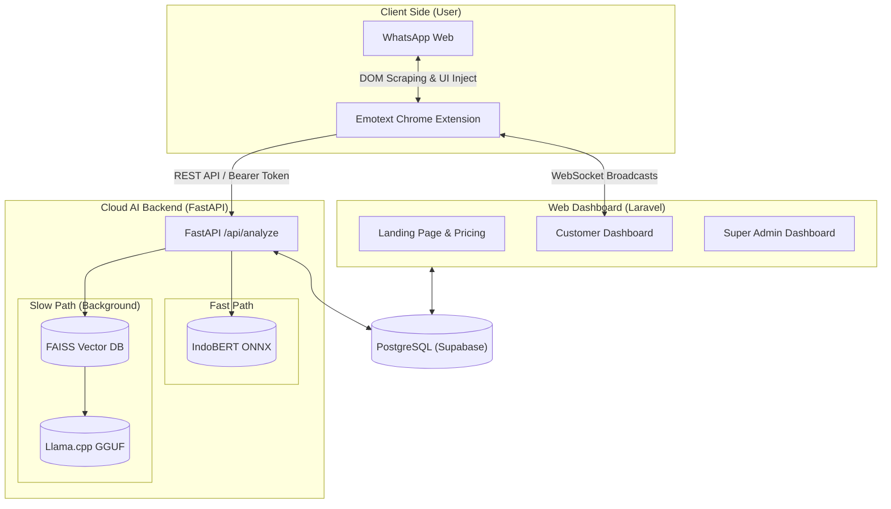
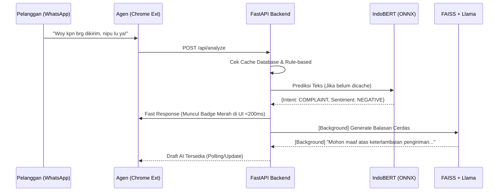

# Emotext-CRM (WA-CRM Intelligence)

**Emotext-CRM** adalah platform *Customer Relationship Management* (CRM) inovatif berskala *Enterprise* yang mengintegrasikan kecerdasan buatan (AI) secara langsung ke dalam antarmuka WhatsApp Web. 

Dirancang khusus untuk tim *Customer Service*, sistem ini secara instan menganalisis sentimen, mendeteksi intensi pelanggan, dan memberikan balasan otomatis berlandaskan *Standard Operating Procedure* (SOP) perusahaan menggunakan arsitektur mutakhir **Offline Retrieval-Augmented Generation (RAG)**.

Sistem beroperasi dengan model bisnis **SaaS (Software as a Service)**, yang memisahkan ekstensi klien super ringan (< 5MB) dari mesin AI (*Backend*) raksasa yang aman di server cloud. Manajemen platform ini dilakukan melalui Dashboard Web terpusat yang dibangun di atas Laravel 10 dan Tailwind CSS.

---

## ✨ Fitur Unggulan (Core Features)
- **🧠 Localized NLP Engine (IndoBERT v2.0):** Dilatih khusus (Fine-Tuned) dengan >4.000 data sintesis bahasa jalanan, singkatan ekstrem, dan sarkasme. Akurasi klasifikasi Sentimen dan Intensi mencapai tingkat manusia.
- **📚 Offline RAG Knowledge Base:** Menjalankan model Llama GGUF dan FAISS di *Backend* untuk membaca dokumen SOP perusahaan tanpa pihak ketiga seperti OpenAI. Menjamin kerahasiaan data tingkat militer.
- **⚡ Arsitektur Fast/Slow Path AI:** Memisahkan klasifikasi instan (<200ms) menggunakan ONNX Runtime (*Fast Path*) dengan pembuatan *draft* balasan AI menggunakan RAG Llama (*Slow Path* via background tasks).
- **💼 Multi-Tier Subscription:** Sistem manajemen berlangganan *enterprise-ready* dengan paket: Trial (7 Hari), Starter, Pro, dan Enterprise. Tersedia badge penanda masa kedaluwarsa.
- **🛠️ Self-Learning Memory & Feedback:** *Super Admin* dapat memantau tingkat akurasi model dan memperbaiki klasifikasi yang salah. Pelanggan dan Guest dapat mengirimkan laporan/bug melalui form *Product Feedback*.
- **📊 Real-time CRM Dashboard:** Pelanggan dapat memantau *Health Score* pelanggan mereka, grafik tren sentimen harian, persentase niat beli/komplain, hingga notifikasi pop-up waktu-nyata via WebSockets (Laravel Reverb).

---

## Arsitektur Sistem (Client-Server Architecture)

Untuk melindungi *Intellectual Property* model AI dan menjaga performa perangkat pelanggan (agar tidak membebani RAM laptop), Emotext-CRM memisahkan komputasi berat ke *Cloud*.

---

## Alur Pipeline Kecerdasan Buatan (AI Flow)

Proses yang terjadi di dalam *Backend* dalam satuan milidetik ketika ada pesan masuk:

---

## Panduan Instalasi & Deployment (Bagi Tim & Pengguna)

Kami menyediakan 2 (dua) opsi panduan instalasi yang sangat terperinci tergantung pada infrastruktur yang ingin Anda gunakan. Silakan baca dan ikuti salah satu panduan berikut:

1. **[Panduan Mode Cloud / Hugging Face](SETUP_HF_MODEL.md)** *(Sangat Disarankan)*
   Jalur *default* tanpa perlu men-*download* model raksasa. Menjalankan *Web Dashboard* secara lokal dengan menarik *Resource* AI dari Hugging Face Cloud.

2. **[Panduan Mode Lokal / Offline](SETUP_LOCAL_MODEL.md)** *(Advanced)*
   Jalur *offline* penuh untuk menjaga kerahasiaan data di *on-premise* Anda atau memanfaatkan akselerasi GPU lokal (NVIDIA). Membutuhkan unduhan model fisik (GGUF & ONNX) dan proses *running* Backend Python secara mandiri.

*(Bagi Pelanggan Akhir: Hubungi administrator sistem Anda untuk mendapatkan URL Dasbor dan Ekstensi terkompresi).*

---

## Panduan Pengaktifan & Login

Sistem diamankan dengan kredensial berlangganan untuk mencegah penggunaan pihak ketiga yang tidak sah.

1. Hubungi Sales atau Daftar melalui Landing Page untuk mendapatkan Akun Langganan.
2. Buka [WhatsApp Web (web.whatsapp.com)](https://web.whatsapp.com) di Google Chrome Anda setelah memasang Ekstensi Emotext.
3. Saat pertama kali dibuka, layar *pop-up* Emotext-CRM akan muncul meminta otentikasi (API Token yang didapat dari Dashboard Pelanggan).
4. Setelah berhasil *Login*, sistem akan aktif secara permanen dan secara ajaib menyulap tampilan WhatsApp Web Anda menjadi dasbor CRM kelas atas!

---

*Emotext-CRM v1.0 - Enterprise Release. Developed by Fawwaz.*
